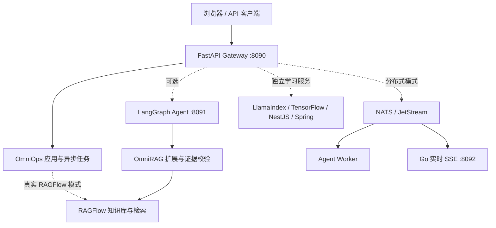

# OmniForge AI

**OmniForge AI** 是一个面向大模型应用开发的源码与学习合集。仓库以 [RAGFlow v0.27.2](https://github.com/infiniflow/ragflow) 为基础，整理了 **OmniRAG-Agent** 的检索与 Agent 研究扩展、**OmniOps Copilot** 应用，以及 **OmniAI Modular Platform V2** 的模块化服务和动手实验。

这里既有可以独立阅读的专题笔记，也有 API、Agent、向量检索、多模态、分布式通信和多语言服务的实现。它适合按模块学习、在本地复现实验，并作为继续开发的起点。仓库中的代码和静态检查结果不等于完整的线上质量或生产部署证明；具体边界见下方的[验证状态](#验证状态与复现原则)。

> **命名说明**：OmniForge AI 是本 GitHub 仓库的名称；代码中沿用 `OmniAI`、`OmniRAG` 和 `OmniOps` 命名，分别指模块化集成层、研究扩展层和产品应用层。上游 RAGFlow 的原始说明保留在 [RAGFLOW_README.md](RAGFLOW_README.md)。

## 目录

- [项目组成](#项目组成)
- [系统架构](#系统架构)
- [功能与代码位置](#功能与代码位置)
- [快速开始](#快速开始)
- [Docker 模块化运行](#docker-模块化运行)
- [接入真实 RAGFlow](#接入真实-ragflow)
- [学习路线](#学习路线)
- [验证状态与复现原则](#验证状态与复现原则)
- [数据、安全与许可](#数据安全与许可)

## 项目组成

| 层次 | 职责 | 入口 |
| --- | --- | --- |
| RAGFlow 0.27.2 | 文档解析、知识库、检索运行时、模型接入及原生 UI/API | [上游说明](RAGFLOW_README.md)、`api/`、`rag/`、`web/` |
| OmniRAG-Agent | 自适应检索、视觉检索、证据校验、Agent 治理、工具策略与评测方案 | [OmniRAG 概览](OMNIRAG.md)、`extensions/omnirag/`、`docs/omnirag/` |
| OmniOps Copilot | 面向事件与设备的应用流程、证据展示和演示数据 | `apps/omniops/`、[产品说明](OMNIOPS.md) |
| OmniAI Modular Platform V2 | FastAPI 网关、LangGraph Agent、异步任务和独立学习服务 | [OmniAI 概览](OMNIAI.md)、`services/`、`omniai_platform/` |
| 学习与实验 | 15 篇专题笔记、框架实验、基准脚本和部署示例 | `docs/learning/`、`labs/`、`benchmarks/`、`infra/omniai/` |

**归属边界**：RAGFlow 上游负责其原有的解析、存储、检索、Agent Canvas、MCP 接入及基础设施；OmniRAG 和 OmniAI 是在此基础上的扩展与集成。各组件的复用依据见[上游组件说明](docs/omniai/UPSTREAM_COMPONENTS.md)和[复用决策](docs/omniai/GITHUB_REUSE_DECISIONS.md)。

## 系统架构



网关负责 HTTP 接入、OpenAPI、请求标识、限流、并发边界、幂等请求和异步任务接口。Agent、索引与模型服务保持独立依赖环境，避免把不同框架的依赖强行放进 RAGFlow 的 Python 环境。任务后端可以使用本地实现或 NATS；本地任务管理器只适用于单进程演示。详细设计见[架构文档](docs/omniai/ARCHITECTURE.md)与[集成报告](docs/omniai/INTEGRATION_REPORT.md)。

## 功能与代码位置

| 主题 | 内容 | 主要位置 |
| --- | --- | --- |
| 检索与多模态 | 固定基线、自适应混合检索、视觉侧索引、融合与证据验证 | `extensions/omnirag/`、`rag/nlp/search.py`、`docs/omnirag/` |
| Agent 编排 | 分类、检索、工具、生成、验证与有界重试 | `services/omniai_agent/`、`extensions/omnirag/agent/` |
| API 网关 | OmniOps API、异步作业、SSE、限流和指标 | `services/omniai_gateway/`、`omniai_platform/` |
| 工具与 MCP | 只读工具、工具选择策略、MCP 示例 | `extensions/omnirag/`、`scripts/omniai/mcp_app.py` |
| 向量与索引 | 余弦检索、Milvus Lite、LlamaIndex 对比实验 | `labs/vector_lab/`、`services/omniai_llamaindex/` |
| 模型与训练 | Transformers/LoRA 路由研究、TensorFlow/Keras 实验 | `labs/tensorflow_lab/`、`services/omniai_tensorflow/`、`docs/omnirag/` |
| 分布式与多语言 | NATS、Go SSE、NestJS BFF、Spring Boot 连接器 | `services/omniai_realtime_go/`、`services/omniai_bff_nest/`、`services/omniai_enterprise_spring/` |
| 部署与观测 | Compose profiles、Prometheus 配置和验证脚本 | `infra/omniai/`、`scripts/omniai/` |

各服务可以分别学习和验证。运行某个实验模块，并不自动证明整个系统的吞吐量、召回质量或生产稳定性。

## 快速开始

准备 Git 和 Python 3.13，并在希望保存项目与数据的位置克隆仓库。下面使用仓库内的 `.venv` 和 `.local-data` 目录；两者均已加入 `.gitignore`。演示模式不要求先启动 RAGFlow。

```bash
git clone https://github.com/ytt070666/OmniForge-AI.git
cd OmniForge-AI
python -m venv .venv
```

Windows PowerShell：

```powershell
$python = Join-Path (Get-Location) '.venv\Scripts\python.exe'
$env:OMNIOPS_MODE = 'demo'
$env:OMNIOPS_DATA_ROOT = Join-Path (Get-Location) '.local-data'
& $python -m pip install -r services/omniai_gateway/requirements.txt
& $python scripts/omnirag/run_omniops.py
```

Linux/macOS：

```bash
source .venv/bin/activate
export OMNIOPS_MODE=demo
export OMNIOPS_DATA_ROOT="$(pwd)/.local-data"
python -m pip install -r services/omniai_gateway/requirements.txt
python scripts/omnirag/run_omniops.py
```

需要镜像时，可将 pip 安装命令加上 `-i https://pypi.tuna.tsinghua.edu.cn/simple`。网关运行后可访问：

| 地址 | 用途 |
| --- | --- |
| `http://127.0.0.1:8090/` | OmniOps 页面 |
| `http://127.0.0.1:8090/docs` | OpenAPI 文档 |
| `http://127.0.0.1:8090/api/v1/health` | 健康检查 |
| `http://127.0.0.1:8090/api/v1/platform/modules` | 模块注册信息 |

Agent、LlamaIndex 和 TensorFlow 使用各自的依赖环境，安装要求见相应的 `requirements.txt`。本机管理脚本 `scripts/omniai/dev.ps1` 可通过 `OMNIAI_RUNTIME_ROOT` 指向自选的运行目录；未设置时使用仓库中的 `.runtime`（已忽略）。

## Docker 模块化运行

`infra/omniai/docker-compose.yml` 将网关与可选服务拆成 profile。运行前请确认 Docker 的镜像、卷和资源配置符合本机需求；构建与启动会下载镜像并创建本地数据。

```powershell
# 从仓库根目录运行网关
docker compose -f infra/omniai/docker-compose.yml --profile core up --build gateway
```

| Profile | 可选组件 | 常用端口 |
| --- | --- | --- |
| `core` | FastAPI Gateway | 8090 |
| `agent` | LangGraph Agent | 8091 |
| `rag` | LlamaIndex 对比服务 | 8094 |
| `distributed` | NATS、Agent Worker、Go 实时服务 | 4222、8092 |
| `polyglot` | NestJS BFF、Spring Boot 连接器 | 8093、8096 |
| `ml` | TensorFlow 服务 | 8095 |
| `observability` | Prometheus | 9090 |

这些 profile 是组合与学习入口，依赖的模型、数据、凭据以及实际资源需求需在目标环境另行配置。编排文件中的服务、环境变量与端口以[Compose 文件](infra/omniai/docker-compose.yml)为准。

## 接入真实 RAGFlow

演示模式只用于检验应用交互和接口。要使用真实知识库，先按[RAGFlow 上游说明](RAGFLOW_README.md)准备 RAGFlow v0.27.2，确认后端 API、文档解析、嵌入模型和知识库可用，再通过环境变量配置 `OMNIOPS_MODE=ragflow`、`OMNIOPS_RAGFLOW_API_ROOT`、`OMNIOPS_RAGFLOW_API_KEY` 与 `OMNIOPS_RAGFLOW_CHAT_ID`。变量示例见 [`infra/omniai/.env.example`](infra/omniai/.env.example)；真实凭据不要提交到仓库。

如要对比 OmniRAG 的检索改进，请遵循[本地执行顺序](docs/omnirag/FINAL_LOCAL_EXECUTION_PLAN.md)：先记录未改动的检索基线，再分别验证自适应检索、多模态检索及后续 Agent/工具能力。各阶段结果应分别归档，不能把静态检查当作真实检索质量结果。

## 学习路线

建议先读[完整学习路径](docs/omniai/LEARNING_PATH.md)，再按下表选择实验。`docs/learning/` 提供 15 篇中文专题笔记。

| 阶段 | 建议顺序 | 对应内容 |
| --- | --- | --- |
| 基础 | 大模型与 Transformers → 向量检索 → RAG | [01 模型](docs/learning/01_llm_transformers.md)、[02 向量](docs/learning/02_vector_search.md)、[03 RAG](docs/learning/03_rag.md) |
| 编排 | LangChain → LangGraph → LlamaIndex → FastAPI | [04 LangChain](docs/learning/04_langchain.md)、[05 LangGraph](docs/learning/05_langgraph.md)、[06 LlamaIndex](docs/learning/06_llamaindex.md)、[07 FastAPI](docs/learning/07_fastapi.md) |
| 工程 | NATS → Go → NestJS → Spring → TensorFlow | [08 分布式](docs/learning/08_distributed_nats.md)、[09 Go](docs/learning/09_go.md)、[10 NestJS](docs/learning/10_node_nestjs.md)、[11 Spring](docs/learning/11_java_spring.md)、[12 TensorFlow](docs/learning/12_tensorflow.md) |
| 集成 | MCP/函数调用 → 可观测性 → Docker 微服务 | [13 MCP](docs/learning/13_mcp_function_calling.md)、[14 可观测性](docs/learning/14_observability.md)、[15 部署](docs/learning/15_docker_microservices.md) |

学习时可以先运行 `labs/` 中的独立示例，再追踪 `services/` 中的实现，最后阅读 `docs/omnirag/` 的阶段设计与评测方案。

## 验证状态与复现原则

- 本仓库包含源码、配置模板、设计文档和部分版本化示例。此前在本地进行过静态检查、接口检查与部分独立服务运行验证，范围见[集成报告](docs/omniai/INTEGRATION_REPORT.md)。
- 本机运行报告、基准结果、视觉索引、模型权重与私有数据未上传。仓库读者需要在自己的环境中重新运行相关检查，不能从源码存在推断实时质量指标。
- OmniRAG 阶段文档中有早期的 `pre-local` 状态记录；阅读时应以对应阶段的具体实验数据和当前环境的重新验证为准。[Phase 1 基线流程](docs/omnirag/PHASE1_RUNTIME_BASELINE.md)与[Phase 3 多模态方案](docs/omnirag/PHASE3_MULTIMODAL_VERIFICATION_DESIGN.md)说明了如何建立可复现证据。
- 若已有与 `scripts/omniai/dev.ps1` 约定一致的独立环境，可以运行 `powershell -File scripts/omniai/dev.ps1 validate` 执行项目验证脚本；该命令会运行自检并可能生成本地清单，不是只读检查。运行前请查看脚本及其依赖。
- 尚未合入主项目的本机实验没有纳入本仓库。上线前仍需完成目标环境的功能、质量、性能和安全验证。

## 数据、安全与许可

请把 API 密钥、密码、模型文件、知识库数据、运行日志和基准输出留在仓库外的本机目录。`.gitignore` 已排除常见的环境文件、运行报告和本机基准结果；新增文件提交前仍需自行检查内容。示例变量放在 `.env.example` 中，不包含真实凭据。

本仓库保留了 RAGFlow 的原始版权与许可文件：[LICENSE](LICENSE)。依赖及其他来源见[第三方说明](THIRD_PARTY_OMNIAI.md)和[上游组件清单](config/omniai/upstreams.json)。如需分发构建产物，请继续保留实际包含的第三方许可声明。